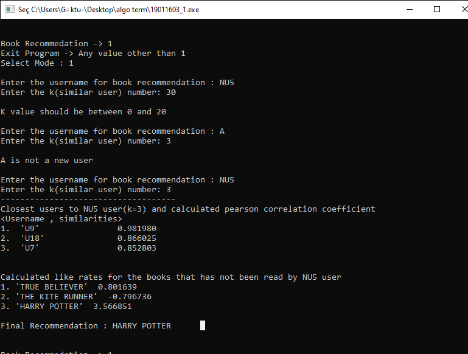

# Book-Recommendation-System
Based on the users past book choices , system recommend new books to user using collaborative filtering

System has 3 subsection

1- Calculating the similarites of a user with other users
  A readers similarity with other readers calculated using pearson coefficient
  
  
  
  
2- Finding the most similar K people to user
  For a given K value , find the most similar K user to user using calculations in first subsection
  
  
3- Recommending a new book to user
  Using the most similar users, recommend a book to user using below formula, N value in this formula indicates most similar K users
  
  
  

Sample outputs using RecomendationDataSet.csv

1- 

 
 
2- 

 
 
 
3- 

 
 
 
 
 
4- 

 
 
 
 
 5- 

 
 
 
 
 
 6- 

 
 
 
 
 7- 

 

  
